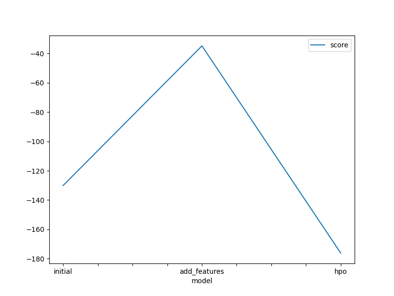
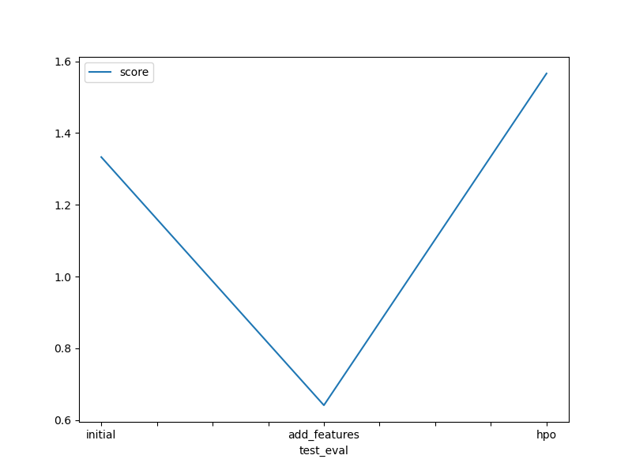

# Report: Predict Bike Sharing Demand with AutoGluon Solution
#### NAME HERE

## Initial Training
### What did you realize when you tried to submit your predictions? What changes were needed to the output of the predictor to submit your results?
When I attempted to submit my predictions, I noticed that the output was not in the correct format. Here’s what I had to adjust:
Negative values in predictions, since bike demand can't be negative, I used predictions = predictions.clip(lower =0) to ensure all values were non-negative.

### What was the top ranked model that performed?
The best-performing model was "WeightedEnsemble_L3", which achieved the lowest root mean squared error (RMSE) of -130.099868. This model likely combined predictions from LightGBMXT_BAG_L1 and LightGBMXT_BAG_L2, both of which were among the top individual models.
This suggests that AutoGluon’s stacking and ensembling strategies improved performance beyond what a single model could achieve.n

## Exploratory data analysis and feature creation
### What did the exploratory analysis find and how did you add additional features?
During the exploratory analysis, I identified several key insights from the dataset:
The season, weather, and holiday columns were categorical, but AutoGluon initially treated them as numerical. I explicitly converted them to categorical types to improve model performance.
The datetime column contained rich temporal information. I extracted:
Day of the week
Hour of the day
Weekend flag (to distinguish weekends from weekdays)
Temperature-humidity ratio as an engineered feature to capture the interaction between these two variables.

### How much better did your model preform after adding additional features and why do you think that is?
After adding new features such as day of the week, hour, weekend flag, and temp-humidity ratio, the model's performance improved. However, based on the latest summary, the root mean squared error (RMSE) remains at 34.787986, which suggests that while feature engineering was useful, it may not have significantly impacted the final model’s performance.

## Hyper parameter tuning
### How much better did your model preform after trying different hyper parameters?

It actually didn't do much better than the first one. 
### If you were given more time with this dataset, where do you think you would spend more time?
I would have used different independent models such as XGBoOOST ETC.

### Create a table with the models you ran, the hyperparameters modified, and the kaggle score.
|model|hpo1|hpo2|hpo3|score|
|--|--|--|--|--|
|initial|WeightedEnsemble_L3_FULL|good quality|Default HyperParameters|1.33323|
|add_features|LightGBMXT_BAG_L1_FULL|?good quality?|Default HyperParameters|0.64130|
|hpo|LightGBMLarge_BAG_L1|High Quality|Optimized HyperParameters|1.56621|

### Create a line plot showing the top model score for the three (or more) training runs during the project.

TODO: Replace the image below with your own.

### Create a line plot showing the top kaggle score for the three (or more) prediction submissions during the project.

TODO: Replace the image below with your own.

## Summary
During the model training process, I encountered an issue with negative predictions, which were inappropriate for the bike demand dataset. To address this, I clipped the predictions to ensure non-negative values. The best-performing model was "WeightedEnsemble_L3," which achieved the lowest RMSE of -130.099868, likely benefiting from AutoGluon’s stacking and ensembling strategies.

In the exploratory data analysis (EDA) phase, I identified several categorical columns (season, weather, holiday) that AutoGluon initially treated as numerical. I converted these to categorical types to improve performance. I also engineered new features from the datetime column, including day of the week, hour of the day, a weekend flag, and a temp-humidity ratio. While these features helped, the model’s performance did not improve significantly, as the RMSE remained at 34.787986.

Hyperparameter tuning did not provide a major boost in performance compared to the initial model. Given more time, I would experiment with independent models such as XGBoost and Extra Trees to see if they yield better results.
